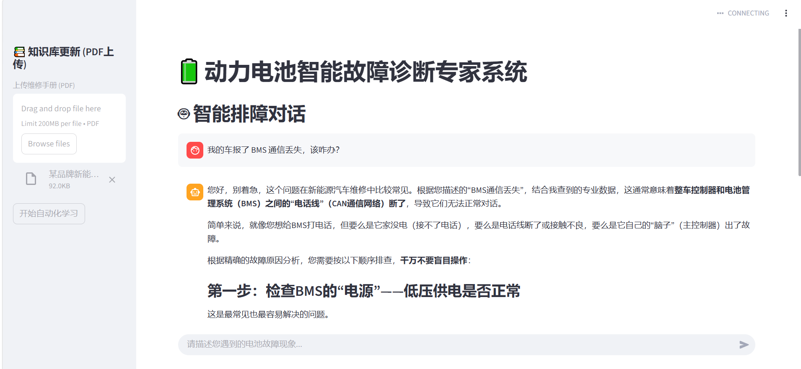

# 🔋 Battery-GraphRAG: 动力电池智能诊断云原生 Agent


 ** 🚀 工业级知识构建与排障中台**：将冗长复杂的汽车《维修手册》转化为结构化的高维图谱，彻底消除大模型在汽车垂直领域的诊断幻觉。

## 📖 项目简介 (Introduction)

本项目针对传统基于向量检索（Vector RAG）在处理新能源整车复杂故障溯源时产生的“语义塌陷”和“推理缺失”痛点，独立研发了**基于云原生图数据库的智能体诊断系统**。

系统打通了从“非结构化文档自动解析”到“多跳图谱在线检索”，再到“微服务化前端交付”的完整全栈闭环，具备直接应用于汽车智能座舱或售后排障 Copilot 场景的工程潜力。

## ✨ 核心特性 (Key Features)

- ** 🕸️ 全自动 Text2Graph 数据管线**：基于强约束 JSON Prompt，一键将长篇 PDF 维修手册解析为 `[故障]-[症状/物理根因]` 三元组，并动态生成 Cypher 语句注入云端 Neo4j 图数据库。
- ** 🛡️ 动态探针与意图防注入**：采用图谱探针实时感知云端合法实体，结合意图降级策略进行 Text2Entity 槽位提取，实现 100% 的并发安全，彻底拒绝恶意注入。
- ** 🧠 零幻觉多跳推理引擎**：跨层级钻取底层物理根因（如线束短路、电芯内阻增大），融合 LLM 软语义，输出严格遵从原厂手册的排障 SOP。
- ** ☁️ 云原生微服务架构**：前后端解耦。基于 **FastAPI** 提供高并发异步诊断接口，基于 **Streamlit** 构建交互式可视化前端，并支持 **Docker** 一键容器化部署。

## 📸 系统运行演示 (Demo)

*(💡 建议：在此处插入一张你在 Streamlit 网页上进行问答的截图，或者录制一个 10 秒的 GIF 动图，展示极速生成专家级回复的过程。)*
 

## 🏗️ 系统架构图 (Architecture)

```text
[PDF 维修手册] 
      │ 
      ▼ (PyPDF2 + DeepSeek API)
[Text2Graph 自动清洗与抽取管线] ──▶ [Neo4j Aura 云端图谱底座]
                                          │
                                          ▼ (Cypher 多跳检索)
[前端 Web 界面] ◀── (RESTful API) ──▶ [FastAPI 诊断核心微服务] ◀── [大模型引擎]
(Streamlit)                           (意图识别 / 防注入拦截)
```

## 技术栈 (Tech Stack)
AI & 大模型：DeepSeek Chat API, Prompt Engineering, GraphRAG
数据工程：Neo4j AuraDB (Cypher), PyPDF2
后端与微服务：FastAPI, Uvicorn, Pydantic, asyncio
前端与部署：Streamlit, Docker, Docker Compose

---

## 🚀 快速开始 (Quick Start)

### 方式一：Docker 极速启动（推荐）
确保你的机器上已安装 Docker 和 docker-compose。

**1.克隆仓库**
```bash
git clone [https://github.com/你的用户名/Battery-GraphRAG.git](https://github.com/你的用户名/Battery-GraphRAG.git)
cd Battery-GraphRAG
```
配置环境变量
在根目录创建 .env 文件，并填入你的鉴权信息：

```bash
Plaintext
NEO4J_URI=neo4j+s://你的数据库地址.databases.neo4j.io
NEO4J_USER=你的数据库账号
NEO4J_PASSWORD=你的数据库密码
DEEPSEEK_API_KEY=sk-你的真实秘钥
一键构建与启动微服务
```

```bash
docker-compose up --build -d
前端访问地址：http://localhost:8501
FastAPI 接口文档：http://localhost:8000/docs
```

###  方式二：本地开发环境启动

```bash
安装依赖：pip install -r requirements.txt
启动 FastAPI 后端：python api_main.py
另起一个终端，启动前端：streamlit run app.py
```

**📂 项目目录结构 (Project Structure)**
Battery-GraphRAG/
```bash
├── api_main.py           # FastAPI 后端微服务主入口
├── app.py                # Streamlit 前端交互页面
├── graph_rag_agent.py    # 核心诊断 Agent 与图谱多跳检索逻辑
├── pdf_to_graph.py       # 自动化 Text2Graph 知识抽取管线
├── eval_pipeline.py      # E2E 全链路自动化测试测评脚本
├── test_api.py           # 基础设施健康度探活脚本
├── requirements.txt      # Python 依赖清单
├── Dockerfile            # 容器化构建指令
├── docker-compose.yml    # 微服务编排配置
└── README.md             # 项目说明文档
```